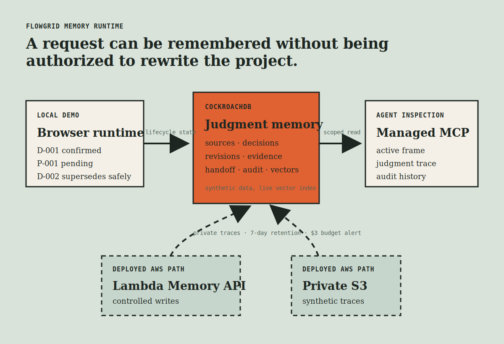
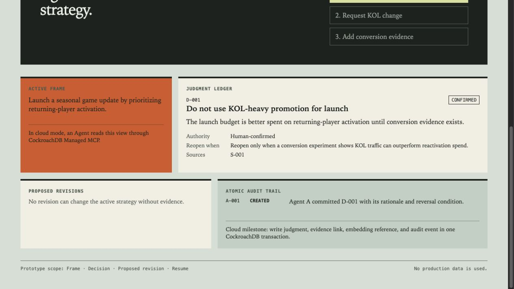
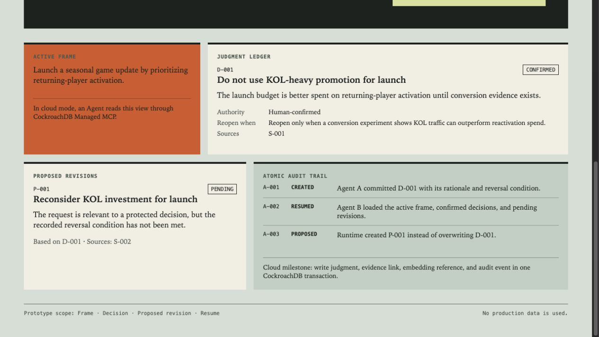
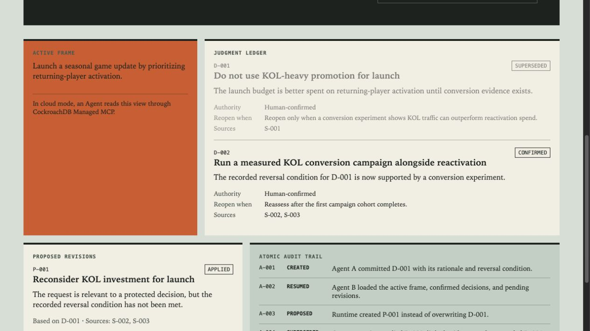

# Hackathon Submission Draft

> Status: draft only. The CockroachDB memory layer is live with synthetic data. AWS deployment and a public functional demo URL remain required before final Devpost submission.



## Project name

FlowGrid Memory Runtime

## Tagline

Agent memory that preserves what is still authorized to change a project.

## Project description

Long-running agents can retrieve context yet still mishandle project commitments: a new request can be treated as permission to overwrite an earlier human decision. FlowGrid Memory Runtime keeps a durable judgment lifecycle instead.

Each confirmed judgment stores its rationale, reversal condition, source events, evidence links, and audit history. A conflicting request becomes a pending proposed revision. It cannot replace an active judgment until qualifying evidence satisfies the recorded reversal condition. When evidence does qualify, the runtime creates a new confirmed judgment, preserves the previous judgment as superseded history, updates the handoff frame, and records the transition.

The demo follows one compact lifecycle:

1. A project owner confirms `D-001`: avoid KOL-heavy launch promotion.
2. Agent B resumes the project and receives the active judgment and its boundary.
3. A KOL request creates pending `P-001`, while `D-001` remains protected.
4. Conversion evidence applies `P-001`, supersedes `D-001`, and confirms `D-002`.

The prototype uses only synthetic data. It does not import FlowGrid project ledgers, private conversations, customer data, or evaluation material.

## Visual proof of the core invariant

| A protected decision | A conflicting request stays pending | Qualifying evidence changes the state |
| --- | --- | --- |
|  |  |  |

## CockroachDB tools used

| Tool | What the prototype does |
| --- | --- |
| CockroachDB Cloud Basic | Persists synthetic projects, source events, judgments, revisions, evidence links, handoffs, and audit events. |
| Distributed Vector Indexing | A live `VECTOR(8)` index on `memory_embeddings` supports semantic recall of related prior judgments. |
| CockroachDB Managed MCP | Inspects the live schema and synthetic judgment lifecycle with scoped read access; it was also used for narrowly approved setup validation. |

The live cluster evidence is recorded in [VALIDATION.md](VALIDATION.md).

## AWS integration status

The repository includes an AWS SAM template for a controlled Lambda write API, API Gateway, and a private S3 trace bucket. For this synthetic demo, the CockroachDB URL is supplied as an encrypted `NoEcho` deployment parameter rather than through a recurring Secrets Manager resource. The Lambda code performs the lifecycle transaction and returns the same Runtime Snapshot contract consumed by the browser.

**Not yet deployed:** no AWS resource, public API URL, or S3 trace bucket has been created. Before final submission, deploy the reviewed SAM stack, record the resulting Demo URL, and show Lambda writing the synthetic lifecycle to CockroachDB. This is required by the hackathon rules because AWS must be meaningfully integrated.

## 90-second video script

| Time | On screen | Narration |
| --- | --- | --- |
| 0:00-0:12 | Title and the initial judgment ledger | “Agents remember conversations, but a retrieved request should not silently overwrite a human commitment.” |
| 0:12-0:30 | `D-001` with rationale and reversal condition | “This confirmed judgment has a boundary: do not use KOL-heavy promotion until conversion evidence exists.” |
| 0:30-0:45 | Resume Agent B | “A new agent resumes with the active frame and judgment. Context recovery does not grant edit authority.” |
| 0:45-1:05 | Create `P-001`; keep `D-001` confirmed | “The conflicting KOL request becomes a pending revision. The protected decision remains intact.” |
| 1:05-1:23 | CockroachDB tables, vector index, and Managed MCP read evidence | “CockroachDB persists sources, judgments, revisions, evidence links, handoffs, audit events, and vector-searchable judgment summaries.” |
| 1:23-1:43 | Supply evidence; show `D-001` superseded and `D-002` confirmed | “Only qualifying conversion evidence changes project truth. The previous decision remains traceable instead of being erased.” |
| 1:43-2:00 | Deployed Lambda endpoint and S3 trace after deployment | “AWS Lambda performs the controlled transaction; the browser receives a read-only runtime snapshot. This turns memory into governed project state.” |

Do not record or publish the final video until the final segment can show the deployed AWS path. The event requires a publicly visible video under three minutes that shows the CockroachDB memory layer in operation.

## Submission readiness

| Requirement | Current evidence | Status |
| --- | --- | --- |
| Public, open-source repository with license and setup instructions | Public repository, MIT license, README, local demo and tests | Ready |
| Agentic application with CockroachDB persistent memory | Live synthetic schema, lifecycle rows, vector index, Managed MCP inspection | Ready |
| Meaningful AWS integration | SAM template and Lambda implementation only | Blocked: deploy required |
| Functional public demo URL | Local Vite demo only | Blocked: deploy or host required |
| Public video under 3 minutes | Script only | Blocked: record after deployment |
| CockroachDB tool explanation | This document and `VALIDATION.md` | Ready |
| AWS service explanation | This document distinguishes implemented from deployed services | Draft only |

## Final submission checklist

1. Run the reviewed AWS deployment and capture its resource identifiers and estimated free-tier cost boundary.
2. Set `VITE_RUNTIME_API_URL` to the deployed read-only endpoint and publish a free, functional demo URL.
3. Record the under-three-minute video using the script above, including CockroachDB memory evidence and the deployed Lambda write path.
4. Add the final demo and video URLs below, then copy the project description into Devpost.

```text
Repository URL: https://github.com/dlxeva/flowgrid-memory-runtime
Demo URL: PENDING_AWS_DEPLOYMENT
Video URL: PENDING_RECORDING
```

## Rule reference

The official rules require a project that uses CockroachDB as persistent memory, is deployed on AWS, has meaningful integration of both components, and includes a functional demo URL plus a public demonstration video under three minutes. See the [official rules](https://cockroachdb-ai.devpost.com/rules).
